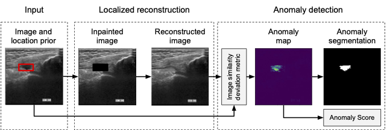

# LoRIS - Weakly-supervised Anomaly Detection for Ultrasound Images

Official implementation to reproduce experiments of Weakly-supervised Anomaly Detection for Ultrasound Images

## Schema
 

## Dataset
```
To set up your experiment you first need to prepare your data, that should be organized in the following way:
../datasets/anomaly (No cv)
|----------/anomaly_0 (First CV folder)
|--------------------/obj (sqr in our case)
|------------------------/boxes (txt file containing bounding boxes for each image in YOLO format)
|------------------------/train (folder containing all the possible classes, i.e. nd and distended)
|------------------------------/nd (folder of the non distended images)
|------------------------------/distended (folder of the distended images)
|------------------------/valid (same as train)
|------------------------/test (same as train)
|----------/anomaly_1 (Second CV folder .....)
```
## Training

To train the different models you need to use:
```
python3 train_loris.py --name lsmri_cv0 --cv_fold 0 --epochs 1000 --patience 50
```

## Evaluation
To evaluate the different models: 
```
python3 test_loris.py --name lsmri_cv0 --cv_fold 0 --metric dd --phase test
```
```
The code generates the corresponding reports under the 'runs/' folder, organized as following:
./runs (Runs folder)
|------/train_figures (Some log of the training process (reconstructed images of train and validation batches))
|------/figures (Some figures extracted by stats.ipynb)
|------/test_{} (Results of the evaluation using {} metric)
|------/reconstructed (test images: origingal, reconstructed and anomaly maps and segmentation maps)
```
To extract informations about the cross validation statistics:
```
python3 stats.py --name loris_cv
```
The code generates a stats folder contating results for the folder containing --name in the path.

## Credits
This work was greatly inspired by this implementation of [RIAD](https://github.com/plutoyuxie/Reconstruction-by-inpainting-for-visual-anomaly-detection.git)
